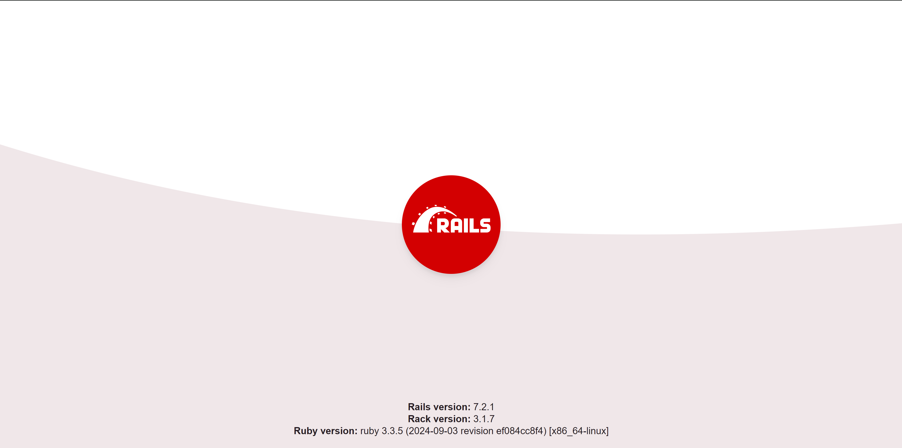

## 1. Reference

1. [Build a RESTful JSON API With Rails 5 - Part 1](https://scotch.io/tutorials/build-a-restful-json-api-with-rails-5-part-one)
2. [Build a RESTful JSON API With Rails 5 - Part 2](https://scotch.io/tutorials/build-a-restful-json-api-with-rails-5-part-two)
3. [Build a RESTful JSON API With Rails 5 - Part 3](https://scotch.io/tutorials/build-a-restful-json-api-with-rails-5-part-three)

## 2. Docker

### 2-1. Setup Docker

```bash
$ docker-compose build
$ docker-compose up -d
```

### 2-2. Rails

#### 2-2-1. Setup Rails application

```bash
$ docker-compose exec app bin/setup
```

#### 2-2-2. Access `localhost:5000`



## 3. API Endpoints

[docs/routes.md](./docs/routes.md)

## 4. How to execute in local development environment

\- Install `httpie` package in advance for convenience referring to [jakubroztocil/httpie](https://github.com/jakubroztocil/httpie)

### 4-1. User

- [docs/user/create](./docs/user/create.md)

### 4-2 Todo

- [./docs/todos/index](./docs/todos/index.md)
- [./docs/todos/show](./docs/todos/show.md)
- [./docs/todos/create](./docs/todos/create.md)
- [./docs/todos/update](./docs/todos/update.md)
- [./docs/todos/delete](./docs/todos/delete.md)

### 4-3. Items

- [./docs/items/index](./docs/items/index.md)
- [./docs/items/show](./docs/items/show.md)
- [./docs/items/create](./docs/items/create.md)
- [./docs/items/update](./docs/items/update.md)
- [./docs/items/delete](./docs/items/delete.md)

### 4-4. Pagination

- [docs/pagination.md](./docs/pagination.md)
